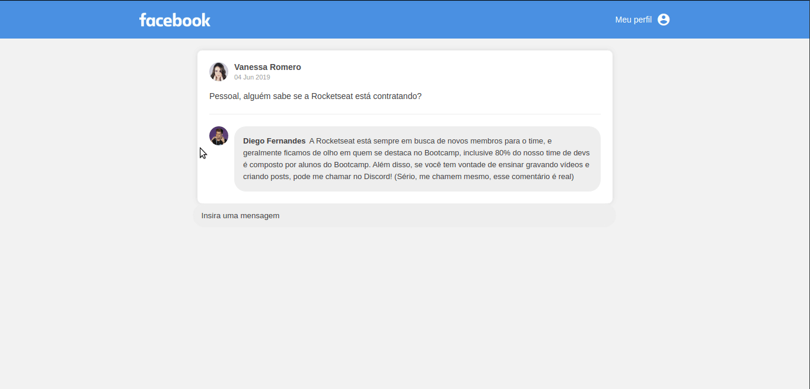

<h1 align="center">Simple Facebook Page</h1>


</h3>
<p align="center">
  <b>Uma simples replica do Facebook para estudar os conceitos de Recact entre eles components, css, array etc.</p>




## Getting Started
Clone o Repositorio e execute os seguintes comandos:
```sh
yarn -> install dependecies
yarn dev start -> run code,
```


### Contributing
  Se gostou deixe uma estrela
